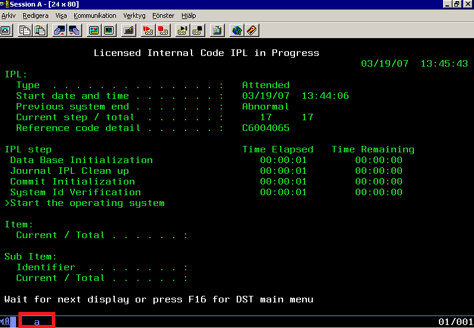

[](http://spacemacs.org)

-------------------------------------------------------------------------------

# AS400 Interface
This package provides interface with AS400 session. Below image shows AS400 window (Image Credit: Wikipedia)

All the communication done over PCOMM(Personal Communication COMM) technology. Host Access Class Library provides nice guide for the same.



# Usage
AS400 instance can be created as below,

``` python
from ibm import Instance

# session "A" is marked in above image with Red box
instance = Instance(session='A')
```
out of the box two pointer are available, ps and oia pointers.

``` text
PS(Presentation Space): provides methods and properties to query and manipulate the AS400 screen objects for the related created instance.
```

``` text
OIA(Operator Information Area): it provides methods and properties to query and manipulate the Operator Information Area, bottom bar.
```

simple program can be created out of the created instance.

From the above base, more useful utility class is provided, its usage is below,

``` python
from ibm import InstanceActions

instance = InstanceActions(session='A')
print instance.gettext(row=4, column=2, length=3')
# "IPL"
instance.wait(1)
# block execution for 1 second
instance.sendkeys(key='[pf16]')
# above command send F16 key press and window get change
```
